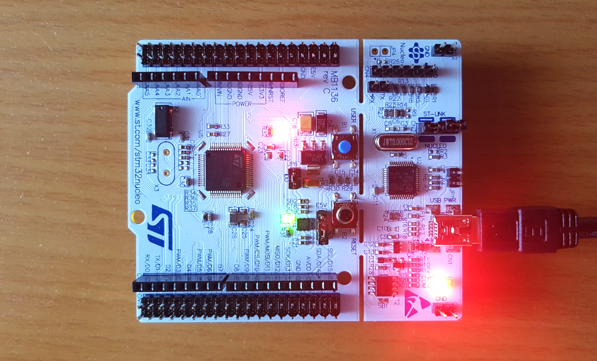

# STM32F401RE Bootloader and Updater

Custom bootloader and updater for STM32F4 based boards.

[](./images/stm32.png)

## Table of contents

- [Setup](#setup)
- [Flashing](#flashing)
  - [Standard method](#standard-method)
  - [Using custom updater](#using-custom-updater)
- [Debugging](#debugging)
- [Connecting to serial port](#connecting-to-serial-port)
- [Credits](#credits)

## Setup

Install dependencies:

* `arm-none-eabi`
* `git`
* `make`
* `npm`
* `python3`
* `stlink-tools`

Run these commands:

```bash
# Clone the repo
git clone https://github.com/dtokayev/stm32-bootloader.git
cd stm32-bootloader
git submodule init
git submodule update

# Build libopencm3
cd libopencm3
make
cd ..

# Build bootloader firmware
cd bootloader
make
cd ..

# Build main application firmware
cd app
make
cd ..

# Install custom updater dependencies
cd fw_updater
npm install
cd ..
```

## Flashing

### Standard method

Connect board to the computer and run

```bash
# Compile bootloader
cd bootloader
make
cd ..

# Compile the entire firmware and flash to board
cd app
make
st-flash write firmware.bin 0x8000000
```

### Using custom updater

1. Compile firmware as in the previous step
2. Copy the firmware to the updater root folder and move to that directory
```bash
cp app/firmware.bin fw_updater/
cd fw_updater
```
3. After connecting the board to PC, press the reset button and run immediately the updater
```bash
tsx index.ts
```

Step 3 may require a couple of tries since the updater may timeout and if the board is given enough time to move to the main application.

## Debugging

```bash
# Connect board to computer

# Start debugging server
st-util

# Start GDB from a separate terminal.
# Replace 'example_file.elf' with desired
# firmware file (e.g. app/firmware.elf or
# bootloader/bootloader.elf)
arm-none-eabi-gdb example_file.elf

# Connect GDB to debugging server
(gdb) target extended localhost:4242

# Load the program
(gdb) load

# Start execution with breakpoint
# at first line of code
(gdb) start
```

## Connecting to serial port

Run `cu -l /dev/ttyACM0 -s 115200`. You may need to change `/dev/ttyACM0` to another path assigned by your OS.

## Credits

I want to thank [Low Byte Productions Youtube channel](https://www.youtube.com/channel/UC56l7uZA209tlPTVOJiJ8Tw) for his [Bare Metal Programming Playlist](https://youtube.com/playlist?list=PLP29wDx6QmW7HaCrRydOnxcy8QmW0SNdQ) which helped me to start with embedded programming.
